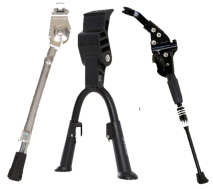

# Markdown voorbeeld

Gewone tekst zonder versieringen

een tekst met een *cursief* en een **vet** deel

hieronder een klein plaatje

## een paragraaf

met een

### subparagraaf

een lijstje

- een 
- twee
- drie

en een genummerd lijstje

1. een
1. twee
1. drie

2 manieren om een link naar een website te maken

<https://docs.centrumvoorstandaarden.nl>

[CvS](https://docs.centrumvoorstandaarden.nl)
